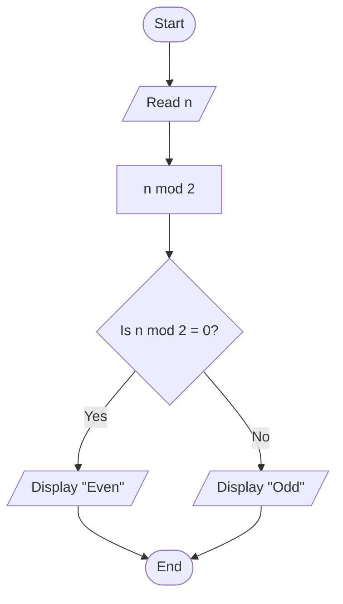

# Introduction to Programming (C++)

**American International University-Bangladesh (AIUB)**
Department of Computer Science, Faculty of Science and Technology

## Class 1 Worksheet: Thinking in Conditions

**Topic:** Solving problems with flowcharts
**Prerequisite:** None. No knowledge of C++ is required for this worksheet.

---

## 1. Purpose of This Worksheet

Before writing any code, a programmer must be able to describe the logic of a solution precisely. In this class you will solve six problems using only **decisions** (yes/no questions). For each problem you will:

1. Read the problem statement carefully.
2. Draw a **flowchart** that solves it.
3. **Test** your solution against the sample cases provided.

Later in the class, your instructor will show how the same logic is written in C++. You will observe that the code closely follows the flowchart you have drawn.

## 2. Flowchart Conventions

| Symbol        | Meaning                                                  |
| ------------- | -------------------------------------------------------- |
| Oval          | **Start** or **End** of the flowchart                    |
| Parallelogram | **Input** (read a value) or **Output** (display a value) |
| Rectangle     | **Process** (a calculation or an assignment)             |
| Diamond       | **Decision** (a yes/no question)                         |

Rules to follow:

- Every flowchart has exactly one Start.
- Every decision diamond contains **one question** and has **two labelled exits**: _Yes_ and _No_.
- Every possible path must eventually reach an End.
- Arrows must show the direction of flow.

**A note on remainders.** Some problems ask whether one number divides another exactly. The **remainder** of a division is the amount left over. For example, 7 divided by 2 leaves a remainder of 1, and 8 divided by 2 leaves a remainder of 0. In flowcharts, write this as **A mod B** (for example, _n mod 2_).

## 3. Combining Conditions

A single decision may combine several conditions using **AND** (both must be true) and **OR** (at least one must be true). For example, a decision may ask: _"Is a greater than 0 AND b greater than 0?"_

## 4. How to Test Your Solution

For each problem, a table of sample inputs and expected outputs is provided. Trace each input through your flowchart by following the arrows with your finger or pencil. If your flowchart does not produce the expected output for any case, find the point at which it goes wrong and correct it.

Passing the sample cases is necessary but not sufficient. Ask yourself whether there are other inputs your flowchart might mishandle.

---

## Problem 1: Even or Odd

**Level 1**

### Problem Statement

Read an integer. Determine and display whether it is even or odd.

### Sample Cases

| Input | Expected Output |
| ----- | --------------- |
| 4     | Even            |
| 7     | Odd             |
| 0     | Even            |
| -3    | Odd             |

### Your Tasks

- [ ] Draw the flowchart.
- [ ] Trace all four sample cases.

---

## Problem 2: Grade Calculator

**Level 2**

### Problem Statement

Read a student's marks (0 to 100). If the marks are outside this range, display "Invalid". Otherwise, display the grade using the following scale:

| Marks    | Grade |
| -------- | ----- |
| 80 - 100 | A     |
| 70 - 79  | B     |
| 60 - 69  | C     |
| 50 - 59  | D     |
| 0 - 49   | F     |

_(This is a simplified scale used for practice, and it may differ from the official AIUB grading scale.)_

### Sample Cases

| Input | Expected Output |
| ----- | --------------- |
| 100   | A               |
| 80    | A               |
| 79    | B               |
| 50    | D               |
| 49    | F               |
| 0     | F               |
| -1    | Invalid         |
| 101   | Invalid         |

### Your Tasks

- [ ] Draw the flowchart.
- [ ] Trace all eight sample cases.
- [ ] **Think about it:** Does the order of your decisions matter? What would happen if you rearranged them?

---

## Problem 3: Bus Fare by Age

**Level 2**

### Problem Statement

A city bus has a base fare of 40 taka. Read a passenger's age and display the fare:

| Age                  | Fare          |
| -------------------- | ------------- |
| Below 5              | 0 taka (free) |
| 5 to 12 (inclusive)  | 20 taka       |
| 13 to 59 (inclusive) | 40 taka       |
| 60 and above         | 30 taka       |

If the age is negative, display "Invalid age".

### Sample Cases

| Input | Expected Output |
| ----- | --------------- |
| 4     | 0               |
| 5     | 20              |
| 12    | 20              |
| 13    | 40              |
| 59    | 40              |
| 60    | 30              |
| -1    | Invalid age     |

### Your Tasks

- [ ] Draw the flowchart.
- [ ] Trace all seven sample cases, paying close attention to the ages at which the fare changes.
- [ ] **Think about it:** Is there more than one correct flowchart for this problem?

---

## Problem 4: Triangle Validator and Classifier

**Level 3**

### Problem Statement

Read three side lengths. First determine whether they can form a valid triangle. The lengths form a valid triangle only if **all sides are positive** and the **sum of any two sides is strictly greater than the third side**.

If the sides form a valid triangle, classify it as:

- **Equilateral:** all three sides are equal
- **Isosceles:** exactly two sides are equal
- **Scalene:** no two sides are equal

If the sides do not form a valid triangle, display "Not a triangle".

### Sample Cases

| Sides (a, b, c) | Expected Output |
| --------------- | --------------- |
| 3, 3, 3         | Equilateral     |
| 5, 5, 8         | Isosceles       |
| 5, 8, 5         | Isosceles       |
| 3, 4, 5         | Scalene         |
| 1, 2, 3         | Not a triangle  |
| 2, 2, 5         | Not a triangle  |
| 0, 4, 5         | Not a triangle  |

### Your Tasks

- [ ] Draw the flowchart. You will need a decision **inside** another decision.
- [ ] Trace all seven sample cases.
- [ ] **Think about it:** Does the order in which you classify the triangle matter?

---

## Problem 5: Merit Waiver Eligibility

**Level 3**

### Problem Statement

A (fictional) university awards a tuition waiver according to the following policy. Read the student's GPA (0.00 to 4.00), the number of credits taken in the semester, and whether the student failed any course (yes or no).

- A student who took **fewer than 12 credits** **or** who **failed any course** receives no waiver.
- Otherwise, the waiver depends on the GPA:

| GPA                | Waiver |
| ------------------ | ------ |
| 3.90 and above     | 100%   |
| 3.75 to below 3.90 | 50%    |
| 3.50 to below 3.75 | 25%    |
| Below 3.50         | None   |

### Sample Cases

| GPA  | Credits | Failed a course? | Expected Output |
| ---- | ------- | ---------------- | --------------- |
| 3.95 | 15      | No               | 100%            |
| 3.95 | 15      | Yes              | No waiver       |
| 3.95 | 9       | No               | No waiver       |
| 3.90 | 12      | No               | 100%            |
| 3.89 | 12      | No               | 50%             |
| 3.75 | 12      | No               | 50%             |
| 3.50 | 18      | No               | 25%             |
| 3.49 | 18      | No               | No waiver       |

### Your Tasks

- [ ] Draw the flowchart.
- [ ] Trace all eight sample cases.
- [ ] **Think about it:** Can you express the first rule as a single decision? Can you also express it as two separate decisions? Which is clearer?

---

## Problem 6: Leap Year Detection

**Level 4 (Capstone)**

### Problem Statement

Read a year (a positive integer). Determine whether it is a leap year according to the following rules:

- A year divisible by **400** is a leap year.
- Otherwise, a year divisible by **100** is **not** a leap year.
- Otherwise, a year divisible by **4** is a leap year.
- Otherwise, it is **not** a leap year.

Display "Leap year" or "Not a leap year".

### Sample Cases

| Input | Expected Output |
| ----- | --------------- |
| 2024  | Leap year       |
| 2023  | Not a leap year |
| 1900  | Not a leap year |
| 2000  | Leap year       |
| 2100  | Not a leap year |
| 1600  | Leap year       |
| 2026  | Not a leap year |

### Your Tasks

- [ ] Draw the flowchart.
- [ ] Trace all seven sample cases.
- [ ] **Challenge:** Draw a second flowchart that gives the same results but is structured differently (for example, using AND / OR to combine several conditions into a single decision). Verify that both flowcharts agree on every sample case.

---

## 5. Self-Check Before You Finish

Before submitting or discussing your solutions, confirm that each of your flowcharts satisfies the following:

- [ ] It has one Start and every path ends at an End.
- [ ] Every decision has a single question and both _Yes_ and _No_ exits.
- [ ] Every sample case produces the expected output when traced.

## 6. Extension Practice (Optional)

If you finish early, or for practice at home, try the following. Each can be solved with decisions alone.

1. **Largest of Three Numbers:** Read three different integers and display the largest.
2. **Mobile Recharge Bonus:** A recharge earns a bonus percentage that depends on the amount recharged, with an additional bonus if the recharge is made on a weekend. Design the bonus bands yourself.
3. **Simple Login Check:** Grant access only if both the username and the password are correct. Otherwise, display which one was incorrect.
